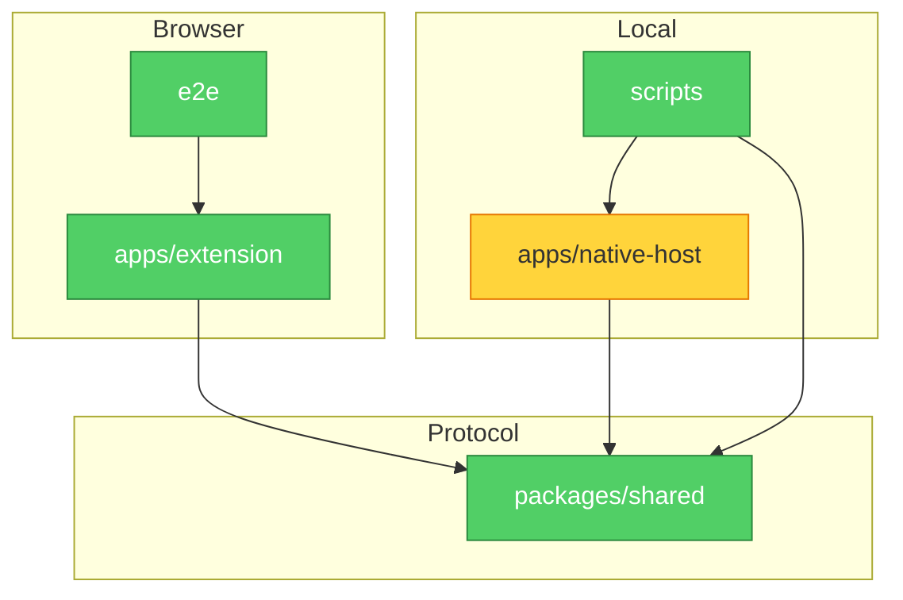

# Brooks-Lint Review

**Mode:** Architecture Audit
**Scope:** entire project, sampled top-level workspace packages, docs/architecture.md, manifests, import edges, and existing architecture boundary tests
**Health Score:** 94/100

FluentFrame has a clear three-module architecture with good package-boundary tests; the main remaining opportunity is to keep composition and dispatcher boundaries from becoming accidental public APIs.

---

## Module Dependency Graph

---

## Findings

### 🟡 Warning

**Dependency Disorder — Native-host dispatcher boundary was under-guarded**
Symptom: `apps/native-host/src/hostRequestHandlers.ts` is the central parsed-request dispatcher and currently exports only `handleParsedRequest`, but the architecture guard suite did not explicitly freeze that dispatcher as the only public boundary.
Source: Clean Architecture — Acyclic Dependencies Principle and Interface Segregation Principle
Consequence: Future queue, cache, notes, or processor internals could be exported through the dispatcher and become de facto APIs for tests or adjacent modules, widening the native-host blast radius.
Remedy: Add a focused architecture test that asserts the parsed-request dispatcher exports only `handleParsedRequest`.

### 🟢 Suggestion

**Cognitive Overload — Large but cohesive native-host persistence module**
Symptom: `apps/native-host/src/queueStore.ts` is the largest source file and combines queue state parsing, lock handling, persistence, and cleanup in one module.
Source: Ousterhout — A Philosophy of Software Design, Modules Should Be Deep
Consequence: Changes to queue persistence remain testable, but maintainers must load several persistence concerns at once.
Remedy: In a later slice, extract a small internal file-lock helper or persistence-path helper if queue work continues in this area.

---

## Summary

The top recommendation is a change-safety guard, not a runtime refactor: preserve the native-host dispatcher as a narrow router-facing interface. Remaining opportunities are larger and should be handled only after choosing a queue persistence or UI module boundary intentionally.
