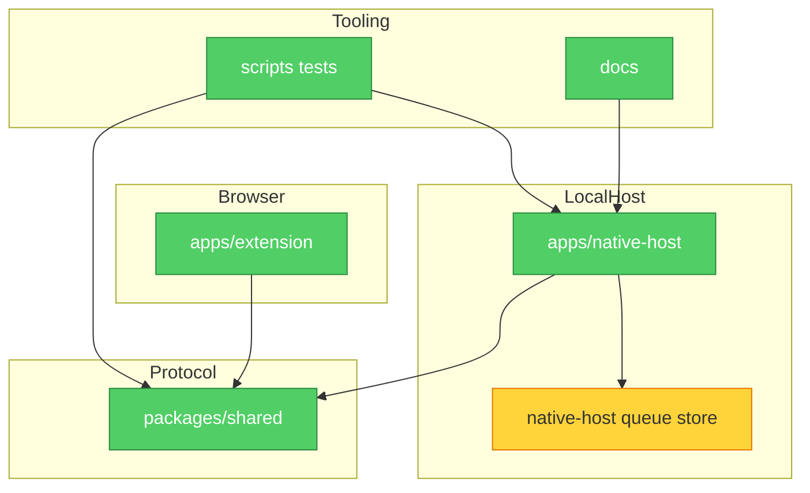

# Brooks-Lint Review

**Mode:** Architecture Audit
**Scope:** Incremental architecture slice 2: native-host queue store internals after slice 1 commit `9524c25`
**Health Score:** 95/100

The workspace keeps a clear three-module shape; the remaining useful architecture work is small locality improvements inside the native-host queue module, not a new layer or runtime contract change.

---

## Module Dependency Graph

---

## Findings

### 🟡 Warning

**R2 Change Propagation — Queue persistence mechanics repeated across state transitions**
Symptom: `apps/native-host/src/queueStore.ts` exposed a deep `QueueStore` interface to callers, but internally repeated the same "map jobs, replace one job, write normalized state" mechanics in enqueue enrichment, claim, heartbeat, progress, and shared job updates.
Source: Ousterhout — A Philosophy of Software Design — Information Hiding; Fowler — Refactoring — Shotgun Surgery
Consequence: Future queue-state changes, such as adding a persisted field or changing normalization behavior, would be easier to apply inconsistently across one of those transition branches even though callers should see a single queue persistence module.
Remedy: Keep the existing public `QueueStore` seam, but give the implementation one private write helper for whole-job-list writes and one private helper for replacing a single job before persistence.

---

## Summary

Slice 2 keeps the module interface stable and consolidates only internal queue persistence mechanics. No Chrome/native messaging protocol, authentication, deployment, secret, or model-provider integration behavior is changed.
