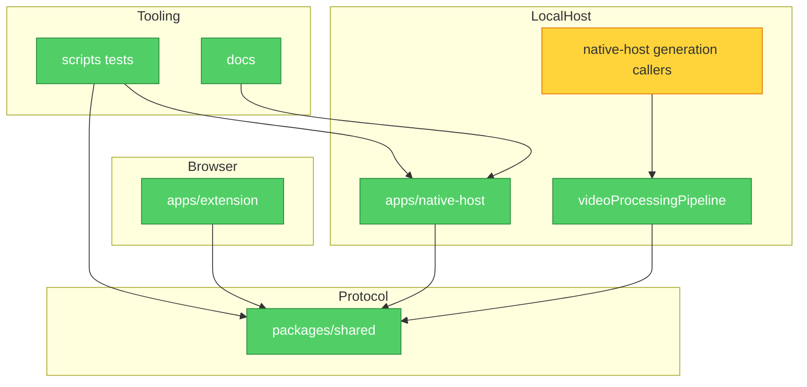

# Brooks-Lint Review

**Mode:** Architecture Audit
**Scope:** Incremental architecture slice 3: native-host generation caller boundary after reports 1 and 2
**Health Score:** 96/100

FluentFrame's package architecture remains clean; the best next architecture slice is a change-safety guard that keeps runtime generation dependency assembly behind the existing native-host pipeline module.

---

## Module Dependency Graph

---

## Findings

### 🟡 Warning

**Dependency Disorder — Runtime generation dependency assembly boundary was under-guarded**
Symptom: `apps/native-host/src/processVideoRequestHandler.ts` and `apps/native-host/src/queueProcessor.ts` correctly call `runVideoProcessingPipeline`, while the accepted ADR says generation dependency assembly belongs behind `videoProcessingPipeline`; however, the architecture guard suite did not prevent those callers from importing caption, cache, agent-runner, processor, or remote-cache runtime internals directly later. Type-only imports such as `ProcessVideoOutput` are permitted when they do not instantiate or call generation internals.
Source: Clean Architecture — Dependency Inversion Principle; Ousterhout — A Philosophy of Software Design, Information Hiding
Consequence: A future direct or queued generation change could rebuild pipeline dependency assembly in the caller, splitting one policy across multiple request paths and making cache, downloader, remote-cache, or local-agent changes propagate through unrelated handlers.
Remedy: Add a focused architecture test that asserts native-host generation callers import the runtime pipeline boundary and do not import generation runtime internals directly.

---

## Summary

The selected slice is intentionally a guardrail: it preserves the current runtime contracts while making the ADR's runtime generation boundary executable. Larger opportunities, such as further reducing `queueStore.ts` size or decomposing UI placement concerns, should remain separate slices with their own tests.
