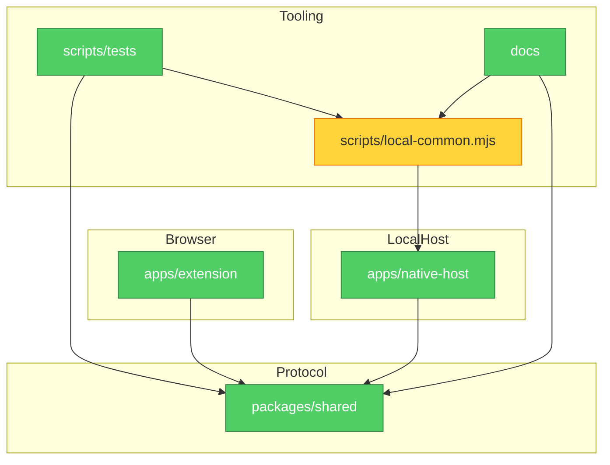

# Brooks-Lint Review

**Mode:** Architecture Audit
**Scope:** Incremental architecture slice 4: local setup native-host-name ownership after committed slices 1-3
**Health Score:** 97/100

FluentFrame's runtime package boundaries remain guarded; this slice adds a startup-safe drift guard for the local setup script copy of the native host name without changing the setup path.

---

## Module Dependency Graph

---

## Findings

### 🟡 Warning

**Knowledge Duplication — Local setup native host name copy was unguarded**
Symptom: `packages/shared/src/protocol.ts` owns `NATIVE_HOST_NAME`, and runtime extension/native-host code imports that owner. `scripts/local-common.mjs` also needs the same string to compute the native messaging manifest path before the workspace has been built, so it carries a startup-safe literal copy that was not checked against the shared owner.
Source: The Pragmatic Programmer — DRY; Ousterhout — A Philosophy of Software Design, Information Hiding
Consequence: A future host-name change could update the shared protocol but leave local install, doctor, or uninstall scripts pointing at a stale manifest path, making setup fail while TypeScript still passes.
Remedy: Keep the setup script's pre-build literal, but add an architecture test that compares `scripts/local-common.mjs`'s exported `nativeHostName` with the shared `NATIVE_HOST_NAME` owner.

---

## Summary

The selected slice is an executable documentation/ownership alignment guard, not a runtime refactor. Importing `packages/shared/dist` from setup scripts would make first-time setup depend on generated artifacts, so the lower-risk architecture move is to keep the project-owned pnpm setup path startup-safe and guard the unavoidable copy against drift.
